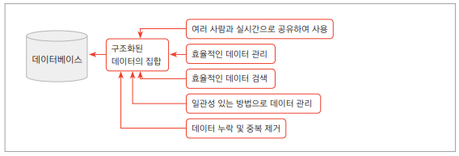
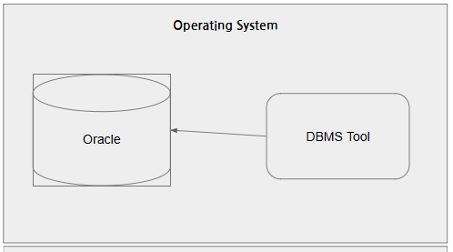
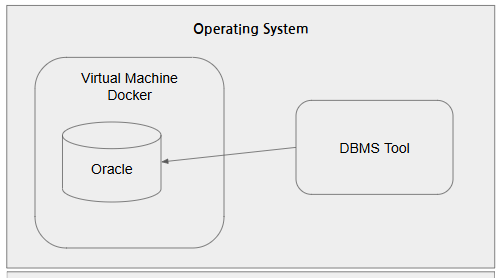
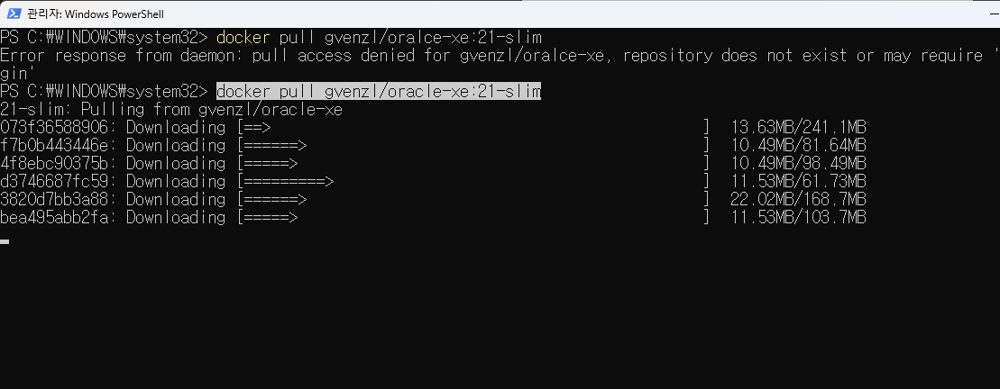
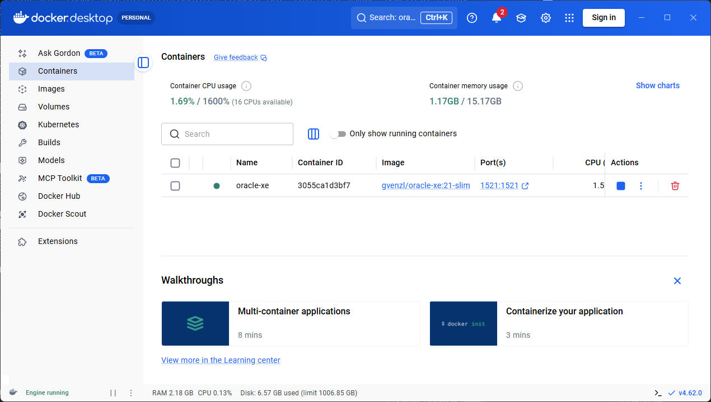
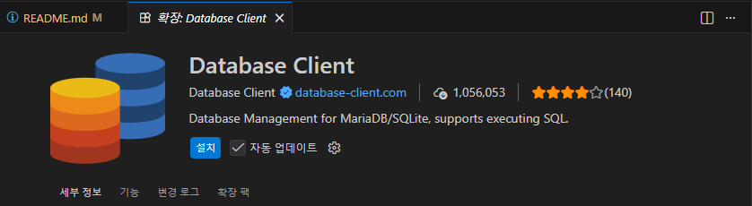
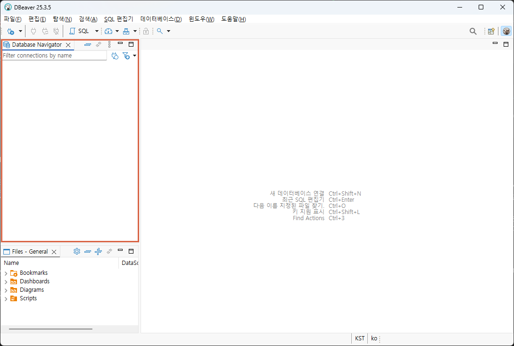
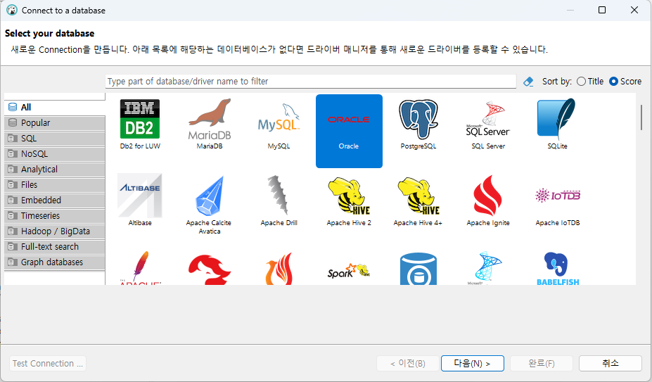
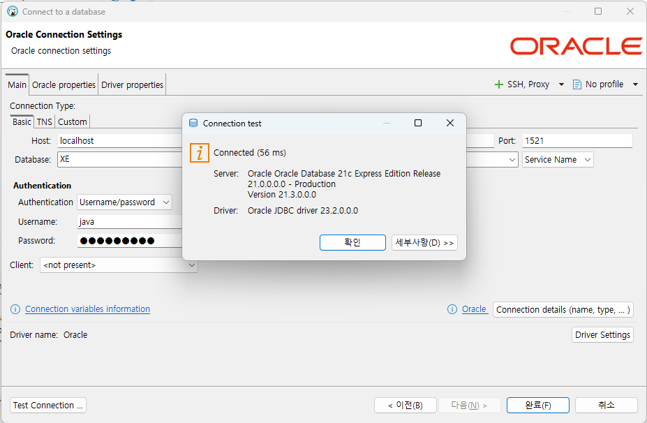
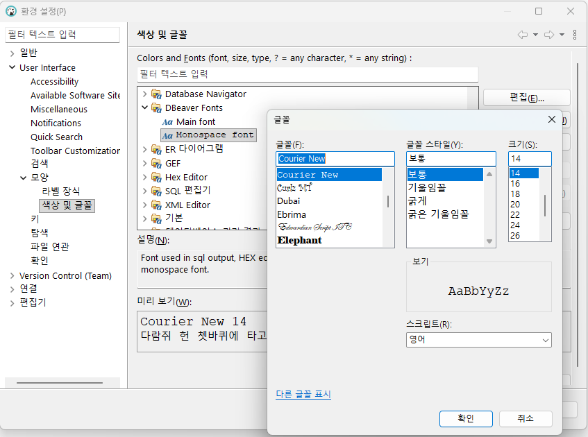

# java-database-2026
자바개발자 과정 데이터베이스 리포지토리

## Day01

### 데이터 / 정보

데이터는 단순한 컴퓨터환경의 특정 값을 의미, 정보는 데이터에 의미를 부여한 것

### 데이터베이스(DataBase : DB)

데이터를 기반으로 하는 관리 시스템을 의미. 데이터를 모아둔 장소를 의미하기도 함.

- DataBase Management System 을 줄여서 DBMS라고 부름
- DBMS를 줄여서 DB라고도 함
- 대부분 기업의 `도메인 정보`를 저장하고 있음.
- IT에서 가장 중요하게 생각해야할 기술 중 하나





### 데이터베이스 종류
- 관계형 데이터베이스(RDDMS)
    - `Oracle` - 학습할 DB
    - SQLServer - Microsoft사 제품. Oracle보다 성능이 낮음
    - MySQL - 오프소스진영에서 Oracle로 합병
    - PostgreSQL - 오픈소스 데이터베이스


- NoSQL 데이터베이스(빅데이터...)
    - Redis
    - MongoDB
    - Apache Cassandra

- IN-Memory 데이터베이스
    - SAP HANA (겁나빠름)


### 오라클 설치 방법
1. 로컬 설치

    

2. 도커 설치(클라우드 동일)

    

### 오라클 설치 이전

1. 도커 설치 - DevOps의 필수품
    - https://www.docker.com/
    - Download Docker Desktop 버튼 클릭
    - Download for Windws - AMD64 선택

2. 설치 후 실행
    - settings(오른쪽 상단 기어모양) 클릭
    - Start Docker Desktop when... 체크 후 Apply

### 오라클 설치

1. Docker Desktop에서 검색 후 Pull로 이미지 다운로드 가능 - 하지말 것

2. Doker Command 사용

    - PowerShell 오픈
        ```bash
        docker --version
        Docker version 29.2.1, build a5c7197
        ```


    - 이미지 검색

        ```bash
        docker search oracle-xe
        NAME                      DESCRIPTION                                      STARS     OFFICIAL
        gvenzl/oracle-xe          Oracle Database XE (21c, 18c, 11g) for every…   355
        owncloudci/oracle-xe                                                       0
        abstractdog/oracle-xe                                                      0
        ```

    - 이미지 당겨오기

        ``` bash
        docker pull gvenzl/oracle-xe:21-slim
        ```

        

    - 컨테이너 실행

        ``` bash
        docker run -d  --name oracle-xe -p 1521:1521 -e ORACLE_PASSWARD=P12345s! gvenzl/oracle-xe:21-slim
        ```

        


    - 컨테이너 내부 접속

        ```bash
        docker exec -it oracle-xe sqlplus system/P12345s!@XE

        21.0.0.0.0 - Production on Thu Feb 26 04:44:53 2026
        Version 21.3.0.0.0

        Copyright (c) 1982, 2021, Oracle.  All rights reserved.

        gin time: Mon Sep 30 2024 01:54:37 +00:00

        Connected to:
        c Express Edition Release 21.0.0.0.0 - Production
        Version 21.3.0.0.0


    - 강의용 사용자 생성

        ```sql
        CREATE USER java IDENTIFIED BY java12345;

        GRANT CONNECT, RESOURCE TO java ;

        GRANT CREATE TABLE TO java;

        grant all privileges to java;

### 데이터베이스 개발툴 DBeaver 설치

1. 개발툴 종류
    - SQL*PLUS - 콘솔개발 화면. 가장 기초적인 SQL실행도구. 매우 사용불편
    - Oracle SQL Developer - 오라클사가 제공하는 무료툴. 오프?소스. java개발툴 eclipse를 커스터마이징해서 개발
    - Toad for Oracle - DB개발툴 가장 강력한 SW. 상용라이선스
    - `DBeaver` - 오픈소스, 거의 모든 DB를 다 사용. 대중성이 매우 높음

2. DBeaver 설치
    - https://dbeaver.io/
    - Community Edition 클릭 windows (Installer) 선택

3. vs code 확장
    - d


        

### DBeaver 사용법

- Database Navigator 에서 DB연결 시작

    

    - 마우스 오른쪽버튼 > Create > Connection

            
    
    - 연결정보 입력 Test Connection
    - 입력 시 주의사항 : Port번호 확인, DataBase 이름변경 Oracle -> XE로, Username, Password 일치


        

### 기본 사용법

- DBeaver
    - 연결된 XE - java > Schema(database와 같은의미) 확장 > JAVA 선택
    - 마우스 오른쪽 버튼 > SQSD
    - 글자 크기 변경 : 메뉴 윈도우 > 환경 설정
        - User Interface > 모양 > 색상 및 글꼴 > DBeaver Fonts > Monospace font 를 편집 

        

- 샘플 데이터베이스 생성

    1. 테이블 생성 : [쿼리](./day01/1.sample_schemas.sql)
    2. 시퀀스 생성 : [쿼리](./day01/2.%20sequence.sql)
    3. 부서데이터 추가 : [쿼리](./day01/3.department_datas.sql)
    4. 직원데이터 추가 : [쿼리](./day01/4.employees_datas.sql)
    5. 고객데이터 추가 : [쿼리](./day01/5.customer_datas.sql)
    6. 상품데이터 추가 : [쿼리](./day01/6.product_datas.sql)
    7. 주문과 주문상세데이터 추가 : [쿼리](./day01/7.order_order_item_datas.sql)

- 간단 연습 : [쿼리](./day01/샘플쿼리.sql)
    - DB 파일은 확장자를 `sql`
    - 하나의 명령으로 ;으로 끝나는 문장을 쿼리(DBeaver에서 쿼리. query) 지칭
    - 쿼리문은 대소문자 구분 없음
    - DBeaver에서 쿼리 한 줄 실행은 `Ctrl + Enter`
    - 여러줄 동시 실행은 `Alt + x`

- SQL(Structured Query Language)
    - 구조화된 질의 언어
    - 관계형 데이터베이스에서 DBMS상에 데이터를 정의, 조작, 제어하기 위해 사용하는 표준 프로그래밍 언어
    