# java-database-2026
자바개발자 과정 데이터베이스 리포지토리

## Day01

### 데이터 / 정보

데이터는 단순한 컴퓨터환경의 특정 값을 의미, 정보는 데이터에 의미를 부여한 것

### 데이터베이스(DataBase : DB)

데이터를 기반으로 하는 관리 시스템을 의미. 데이터를 모아둔 장소를 의미하기도 함.

- DataBase Management System 을 줄여서 DBMS라고 부름
- DBMS를 줄여서 DB라고도 함
- 대부분 기업의 `도메인 정보`를 저장하고 있음.
- IT에서 가장 중요하게 생각해야할 기술 중 하나

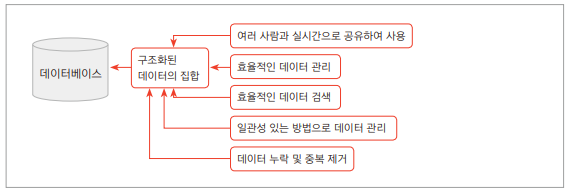


### 데이터베이스 종류
- 관계형 데이터베이스(RDDMS)
    - `Oracle` - 학습할 DB
    - SQLServer - Microsoft사 제품. Oracle보다 성능이 낮음
    - MySQL - 오프소스진영에서 Oracle로 합병
    - PostgreSQL - 오픈소스 데이터베이스


- NoSQL 데이터베이스(빅데이터...)
    - Redis
    - MongoDB
    - Apache Cassandra

- IN-Memory 데이터베이스
    - SAP HANA (겁나빠름)


### 오라클 설치 방법
1. 로컬 설치

    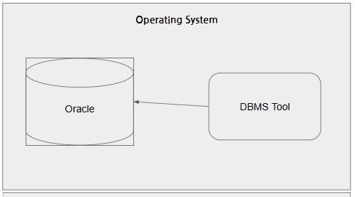

2. 도커 설치(클라우드 동일)

    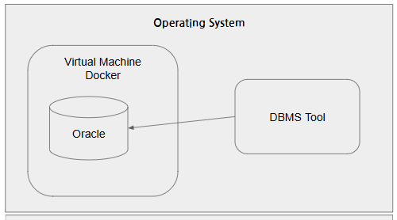

### 오라클 설치 이전

1. 도커 설치 - DevOps의 필수품
    - https://www.docker.com/
    - Download Docker Desktop 버튼 클릭
    - Download for Windws - AMD64 선택

2. 설치 후 실행
    - settings(오른쪽 상단 기어모양) 클릭
    - Start Docker Desktop when... 체크 후 Apply

### 오라클 설치

1. Docker Desktop에서 검색 후 Pull로 이미지 다운로드 가능 - 하지말 것

2. Doker Command 사용

    - PowerShell 오픈
        ```bash
        docker --version
        Docker version 29.2.1, build a5c7197
        ```


    - 이미지 검색

        ```bash
        docker search oracle-xe
        NAME                      DESCRIPTION                                      STARS     OFFICIAL
        gvenzl/oracle-xe          Oracle Database XE (21c, 18c, 11g) for every…   355
        owncloudci/oracle-xe                                                       0
        abstractdog/oracle-xe                                                      0
        ```

    - 이미지 당겨오기

        ``` bash
        docker pull gvenzl/oracle-xe:21-slim
        ```

        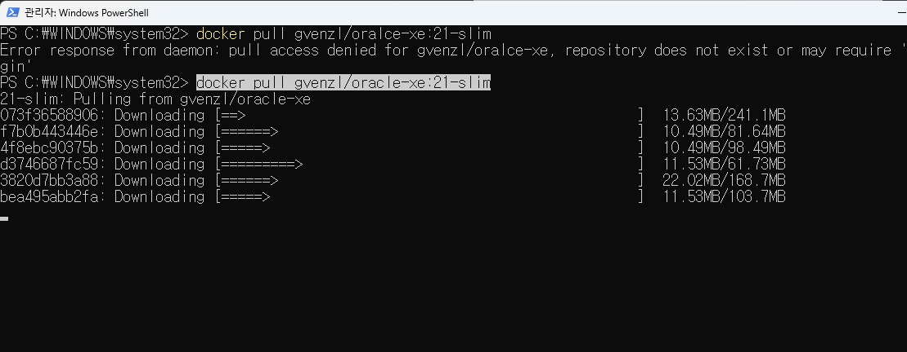

    - 컨테이너 실행

        ``` bash
        docker run -d  --name oracle-xe -p 1521:1521 -e ORACLE_PASSWARD=P12345s! gvenzl/oracle-xe:21-slim
        ```

        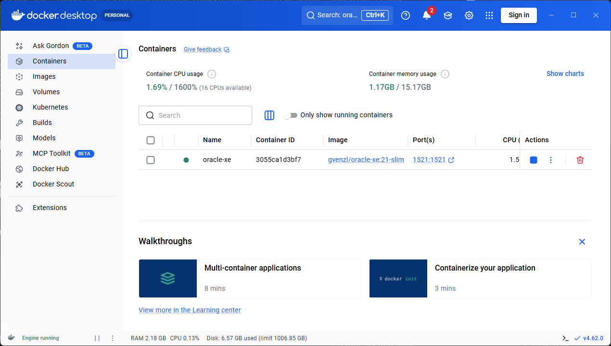

    - 멈춰있는 컨테이너 실행
 
    ```bash
    docker start [컨테이너ID]
    ```

    - 컨테이너 자동 실행 명령

    ``` bash
    docker update --restart=always [컨테이너ID]
    

    - 컨테이너 내부 접속

        ```bash
        docker exec -it oracle-xe sqlplus system/P12345s!@XE

        SQL*Plus: Release 21.0.0.0.0 - Production on Thu Feb 26 04:44:53 2026
        Version 21.3.0.0.0

        Copyright (c) 1982, 2021, Oracle.  All rights reserved.

        gin time: Mon Sep 30 2024 01:54:37 +00:00

        Connected to:
        c Express Edition Release 21.0.0.0.0 - Production
        Version 21.3.0.0.0

        SQL>
        ```

    - 강의용 사용자 생성

        ```sql
        CREATE USER java IDENTIFIED BY java12345;

        GRANT CONNECT, RESOURCE TO java;
        GRANT CREATE TABLE TO java;

        GRANT all privileges To java;  -- INSERT등 추가권한 할당
        ```

### 데이터베이스 개발툴 DBeaver 설치

1. 개발툴 종류
    - SQL*PLUS - 콘솔개발 화면. 가장 기초적인 SQL실행도구. 매우 사용불편
    - Oracle SQL Developer - 오라클사가 제공하는 무료툴. 오프?소스. java개발툴 eclipse를 커스터마이징해서 개발
    - Toad for Oracle - DB개발툴 가장 강력한 SW. 상용라이선스
    - `DBeaver` - 오픈소스, 거의 모든 DB를 다 사용. 대중성이 매우 높음

2. DBeaver 설치
    - https://dbeaver.io/
    - Community Edition 클릭 windows (Installer) 선택

3. VS Code 확장
    - Database Client, Database Client JDBC 확장 설치

    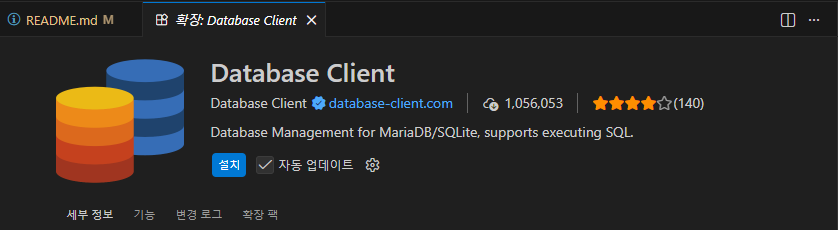


### DBeaver 사용법

- Database Navigator 에서 DB연결 시작

    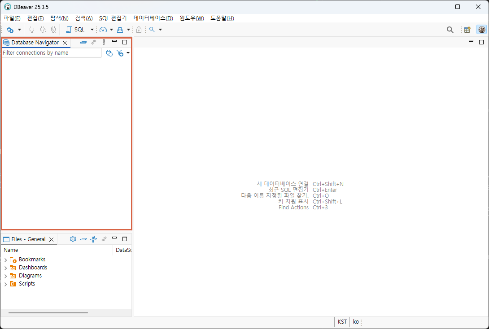

    - 마우스 오른쪽버튼 > Create > Connection

        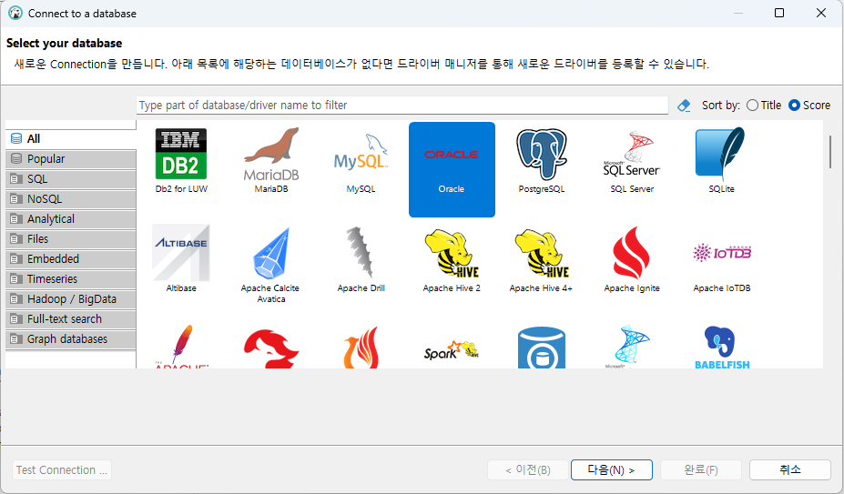    
    
    - 연결정보 입력 Test Connection
    - 입력 시 주의사항 : Port번호 확인, DataBase 이름변경 Oracle -> XE로, Username, Password 일치


        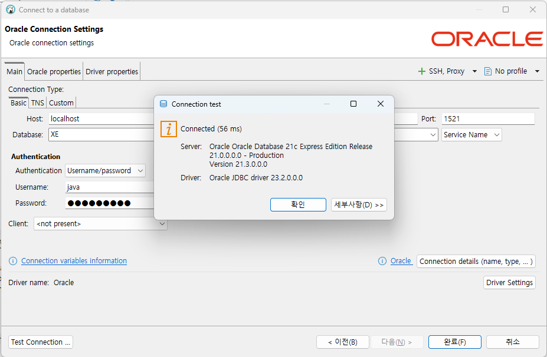

### 기본 사용법

- DBeaver
    - 연결된 XE - java > Schema(database와 같은의미) 확장 > JAVA 선택
    - 마우스 오른쪽 버튼 > SQSD
    - 글자 크기 변경 : 메뉴 윈도우 > 환경 설정
        - User Interface > 모양 > 색상 및 글꼴 > DBeaver Fonts > Monospace font 를 편집 

        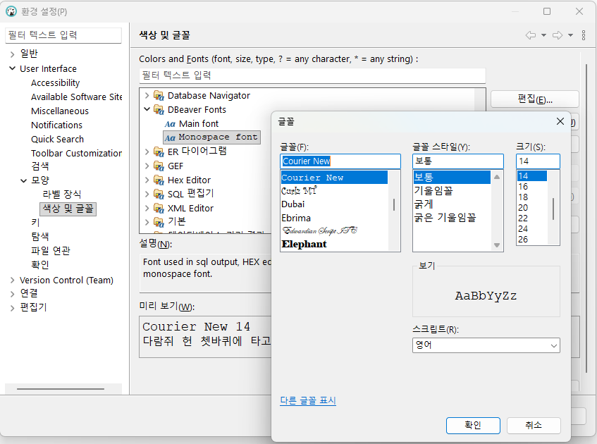

- 샘플 데이터베이스 생성

    1. 테이블 생성 : [쿼리](./day01/1.sample_schemas.sql)
    2. 시퀀스 생성 : [쿼리](./day01/2.%20sequence.sql)
    3. 부서데이터 추가 : [쿼리](./day01/3.department_datas.sql)
    4. 직원데이터 추가 : [쿼리](./day01/4.employees_datas.sql)
    5. 고객데이터 추가 : [쿼리](./day01/5.customer_datas.sql)
    6. 상품데이터 추가 : [쿼리](./day01/6.product_datas.sql)
    7. 주문과 주문상세데이터 추가 : [쿼리](./day01/7.order_order_item_datas.sql)

- 간단 연습 : [쿼리](./day01/샘플쿼리.sql)
    - DB 파일은 확장자를 `sql`
    - 하나의 명령으로 ;으로 끝나는 문장을 쿼리(DBeaver에서 쿼리. query) 지칭
    - 쿼리문은 대소문자 구분 없음
    - DBeaver에서 쿼리 한 줄 실행은 `Ctrl + Enter`
    - 여러줄 동시 실행은 `Alt + x`

- SQL(Structured Query Language)
    - 구조화된 질의 언어
    - 관계형 데이터베이스에서 DBMS상에 데이터를 정의, 조작, 제어하기 위해 사용하는 표준 프로그래밍 언어

## day02

### DBeaver 사용법, DB작업시 사전지식
- 메뉴 상 용어들
    - 검색 > `DB Full-Text` - Full Text Search(대용량 텍스트 내에서 필요한 단어를 검색할 때)
    - SQL 편집기 > `실행계획` - 현재의 쿼리가 실행되는데 비용이 얼마나 발생하는지 파악하는 기술. 최적화해서 실행속도 빠르게 하기 전에 분석
    - 데이터베이스 > `트랜잭션` 모드 - 쿼리들이 실행되는 논리적 덩어리, Auto-Commit(조금 위험), None Commit

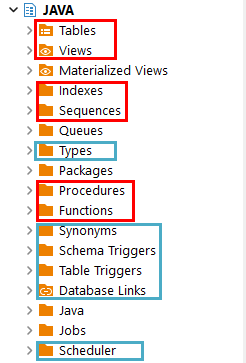

- 위 스키마 하위에서 지금 알아야 할 내용들
    - 테이블
    - 뷰
    - 인덱스
    - 스퀀스
    - 프로시저
    - 펑션
    - +SQL 문법까지

### 기본, SELECT문

- 문법 이전 데이터 타입
    - `NUMBER` 숫자타입, 최대 22byte
    - INTEGER - 정수타입, 모든 데이터 기초 4byte(-21억 ~ +21억)
    - FLOAT - 실수타입, 소수점포함, 최대 22byte
    - `CHAR`(n) - Charactor 문자열 타입, 고정형, 최대 2000byte
        - CHAR(20) 기본 'Hello World'를 저장하면, 'Hello World&nbsp;&nbsp;&nbsp;&nbsp;&nbsp;&nbsp;&nbsp;&nbsp; &nbsp;'로 저장됨. 무조건 자리수를 20자리로 고정해서 생성
    - `VARCHAR2`(n) - 가변형 문자열, 최대 4000byte
        - 오라클에서 VARCHAR(n)는 사용안함
        - VARCHAR2(20)으로 'Hello World'를 저장하면, 'Hello World'. 뒤에 9자리는 버림.
    - `LONG`(n) - 가변길이 문자열, 최대 2Gbyte
    - LONG RAW(n) - 바이너리(이진)데이터, 0과 1의 숫자로만 저장. 최대 2Gbyte
    - CLOB - 대용량 텍스트타입, 최대 4Gbyte
    - BLOB - 대용량 바이너리타입, 최대 4Gbyte
    - `DATE` - 날짜타입. 문자열과 다름

- 데이터 조회 3가지 방법 - [쿼리](./day02/1.%20데이터%20조회%20방법.sql)
    - `셀렉션`(selecion) - 행단위로 조회
    - `프로젝션`(projection) - 열단위로 조회
    - `조인`(join) - 두 개 이상 테이블을 조합해서 조회

- SELECT 문법
    - 기본쿼리, 별명 - [쿼리](./day02/2.%20기본쿼리%20및%20별명지정쿼리.sql)
    - 중복제거 - [쿼리](./day02/3.%20중복제거쿼리.sql)
    - 정렬 - [쿼리](./day02/4.%20정렬쿼리.sql)
    - WHERE절 - [쿼리](./day02/5.%20조건쿼리.sql)

    ```sql
    -- 주석 한줄 주석
    /* 여러줄
        주석(C언어 주석) */
    -- 기본 문법
    SELECT [*|열이름 나열]
      FROM [dual|테이블명];

    -- 별명추가
    select 컬럼명 [AS 별명],
           계산식 AS "별명",
           ...
      FROM 테이블명 [테이블명];

    -- 데이터 정렬
    SELECT 위와 동일
      FROM 테이블명
     ORDER BY [정렬할 열이름(여러개)][ASC|DESC];
    /*
    ASC - ascending(오름차순)
    DESC - descending(내림차순)
    ASC는 기본이고 생략가능
    */

    -- 조건절 WHERE절
    -- 원하는 조건으로 다양하게 조회할 때
    SELECT 위와 동일
      FROM 테이블명
    [WHERE 조회할 행을 선별하는 조건식] 
    [ORDER BY [정렬할 열이름(여러개)][ASC|DESC]];
    ```

- SELECT 연산 - [쿼리](./day02/6.%20연산자.sql)

    ``` SQL
    -- 산술연산자 + - * /
    -- 비교연산자 >(크다) <(작다) >=(크거나같다) <=(작거나같다) ==(같다) <>, != (같지않다)
    -- 논리부정연산자 NOT
    -- in = or와 동일
    -- between
    ```

- 오라클 `함수` : DB별로 추가학습 필요 - [쿼리](./day02/8.%20오라클%20함수.sql)

    - 문자열 함수
        - `UPPER`(모두 대문자), `LOWER`(모두 소문자), `INITCAP`(첫글자만 대문자로)
        - `LENGTH`(문자열길이)
        - `SUDSTR`(문자열, 시작, 길이), 길이를 안적으면 끝까지 추출
        - `INSTR`(문자열, 찾을문자열, [횟수]), 문자열에서 찾을 문자열의 위치를 리턴
        - `REPLACE`(문자열, 찾는문자열, 바꿀문자열), 찾은 문자열을 바꿀문자열로 변경
        - `LAPD`(문자열, 자리수, 채울문자열), RPAD(문자열, 자리수, 채울문자열), L/R 기준으로 자리수만큼 빈공간 특정문자로 채우기
        - `CONCAT`(앞쪽문자열, 뒤쪽문자열), 두 문자열 합치기 
        - `TRIM`(공백이 있는 문자열), `LTRIM`(공백이 있는 문자열), `RTRIM`(공백이 있는 문자열), 문자열 앞뒤의 빈공백 제거

    - 숫자 함수
        - `ROUND`(반올림할수, 반올림위치)
        - `TRUNC`(숫자, 버림위치)
        - `CEIL`(올림할수)
        - `FLOOR`(내림할수)
        - `MOD`(나머지구할수)
    
### DB 특징

- 모든 언어는 인덱스가 0부터 시작
- 단, `데이터베이스는 인덱스 1부터` 시작!

## Day03

### 함수

- 날짜 포맷 단어 * 가장 많이 쓰는 것
    - YYYY, YY - 년도 네자리(2026), 두자리(26)
    - MM, MON, MONTH - 월 두자리(03), MAR, MARCH
    - DD, DDD, DY, DAY - 열 두자리(03), 62(1월 1일부터 며칠째), TUE(화), TUESDAY(화요일)
    - HH24, HH, HH12 - 24시간, 12시간 표현
    - MI - 분
    - SS - 초
    - AM, PM - 오전, 오후 * 잘 안씀

- 오라클 함수 계속 - [쿼리](./day03/1.%20오라클함수.sql)
    - 날짜함수
        - `sysdate` - 기본, 현재 일시를 리턴
        - `add_months`(날짜컬럼, 정수) - 양수는 이후달, 음수는 이전달
        - `month_between`(비교날짜1, 비교날짜2) - 두 날짜사이의 개월 수
        - `next_day`(날짜, '요일') - 날짜 이후의 해당 요일 날짜 리턴
        - `last_day`(날짜) - 해당 날짜의 마지막 일 리턴. 예) 2월 28일 3월 31일 ...

    - 형변환함수
        - `TO_CHAR`(날짜, '날짜포맷') - 날짜를 해당 포맷에 맞게 변경해서 표현
        - `TO_CHAR`(숫자, '숫자포맷') - 숫자를 해당 포맷에 맞게 변경 표현
        - `TO_NUMBER`(숫자로만 된 문자데이터, '숫자포맷') - 수로된 문자열을 숫자로 변경
        - `TO_DATE`(날짜형식문자데이터, '날짜포맷') - 문자데이터를 날짜데이터로 변경

    - NULL 처리함수 - [쿼리](./day03/2.%20NULL함수.sql)
        - `null`(데이터없음)은 일부 개수처리나 통계 불가, null값 처리필요
        - `nvl`(널이들어간데이터, 널처리(0)) - 해당 값이 null이면 보통 0으로 변환
        - `nvl2`(널이들어간데이터, 널이아닐때처리, 널일때처리) - 널이 아닐때와 널일때로 나눠서 처리

    - DECODE, CASE - [쿼리](./day03/3.%20decode_case.sql)
        - 특정열의 데이터가 어떤 데이터인지  따라 다르게 처리할 때
        - python의 if ~ elif ~ elif와 동일한 의미
        - `DECODE`(컬럼, 조건, 결과, ...) - 오라클 전용함수
        - `CASE`문 - CASE ~ WHEN ~ EHEN ~ END ...

### 다중행, 데이터 그룹화

- 다중행(그룹) 함수 - [쿼리](./day03/4.%20다중행함수.sql)
    - 여러 행의 데이터를 바탕으로 하나의 결과를 도출하는 함수
    - `SUM`() - 데이터의 합, 급여, TAX, 점수 등 의미 있는 데이터만 합산할 것
    - `COUNT`() - 데이터 개수, NULL에 지대한 영향을 받는다. 데이터형에 영향을 받지 않음. *(ALL)도 가능
    - `AVG`() - 데이터의 평균. NULL에 영향을 받기 때문에, NULL값은 항상 0등으로 변경해주고 계산.
    - `MIN` - 데이터 중 최소값. 날짜, 문자열도 가능
    - `MAX` - 데이터 중 최대값. 날짜, 문자열도 가능

- 그룹화 - [쿼리](./day03/5.%20그룹화.sql)

    ```sql
    -- 나머지는 이전과 동일. 다중행함수화 group by가 추가.
    select [기존과 동일], 다중행 함수
      from [테이블명|dual]
     where [조건식]
     group by [그룹화할 열 지정] [ROLLUP|CUBE|GROUPING SETS]
    HAVING [그룹함수 필터링]
     order by [정렬조건]

    ```

    - 그룹화 시 유의점
        - SELECT절에 다중행 함수 외 일반컬럼을 사용하고자 하면, 반드시 GROUP BY 절에 일반컬럼이 들어가 있어야 함!
        - `단일 그룹의 그룹 함수가 아닙니다` 오류 메시지 나타남

- HAVING절
    - 일반 SELECT절의 조건은 WHERE절로 처리
    - 다중행 함수 등의 조건은 HAVING절로 처리해야 함.
    - 다중행(그룹) 함수는 WHERE절에 사용불가

- 그룹화 관련 함수 - [쿼리](./day03/6.%20그룹화2.sql)
    - `ROLLUP` - 해당 컬럼별 합계 도출
    - `CUBE` - 해당 컬럼별 상세 소계 도출
    - GROUPING SETS - 차후 ...
    - `PIVOT` - 일반 데이터(세로출력)을 가로출력으로 변경

### SAMPLE 생성

```bash
> docker exec -it oracle-xe sqlplus sys/oracle as sysdba

SQL*Plus: Release 21.0.0.0.0 - Production on Tue Mar 3 05:56:46 2026
Version 21.3.0.0.0

Copyright (c) 1982, 2021, Oracle.  All rights reserved.

Connected to:
Oracle Database 21c Express Edition Release 21.0.0.0.0 - Production
Version 21.3.0.0.0

SQL> alter session set "_oracle_script"=true;
SQL> create user scott identified by tiger
  2  default tablespace users quota unlimited on users;
SQL> grant connect, resource, dba to scott;
SQL> alter session set "_oracle_script"=true;
SQL> alter session set nls_date_language='american';
SQL> alter session set nls_date_format='dd-MON-rr'; 
```

### 조인

- 조인 기본 - [쿼리](./day03/7.%20JOIN.sql)

ㅇ## Day04

- 관계형 데이터베이스
    - 관련된데이터를 테이블 형태로 저장하고, 테이블간 관계를 통해 데이터를 관리하는 DB모델.
    - 테이블 - 테이터를 저장하는 구조. Table/Entity
    - 레코드/로우 - 관련 데이터가 모두 모인 하나의 데이터 행. Record/Row/Tuple
    - 컬럼 - 데이터 특징을 담는 하나의 속성. 열, Colum/Attribute
    - PK - 각 행의 유일하게 식별하는 키. 여러개의 PK를 가질 수도 있음. PrimaryKey
    - FK - 부모테이블의 PK와 관계를 맺는 키 Foreign key

- ERD(Entity Relationship Diagram)
    - 관계형 데이터베이스 구조를 그림으로 표현한 설계도
    - 테이터베이스를 만들기 전에 어떤 테이블이 필요하고 어떤 관계를 맺어야 하는지 시각적 표현

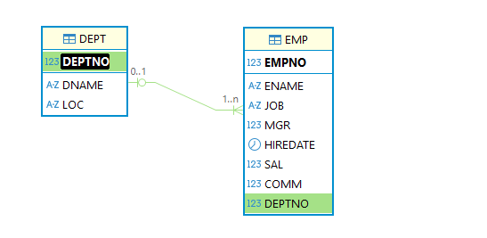

- ERD 설명
    - PK - DEPT.DEPTNO, EMP.EMPNO
    - FK - EMP.DEPTNO
    - 일반컬럼 - 그 외 나머지 컬럼
    - 부자관계 - DEPT(부), EMP(자)


- 조인 계속 
    - 등가조인 - `내부조인`, `Inner Join`, Equi Join
    - 비등가조인 - 등가조인 외의 방법, Between 등 사용. 많이 사용안함
    - 셀프조인 - 자체조인. 자기테이블을 조인. 자기 테이블내에 해당 PK와 관련있는 FK가 지정되어 있어야
        - 대부분 회사에서 조직도, 상사와 부하직원 관계볼 때 사용
    - 외부조인 - 등가조인 반대. `Outer Join`. 조인 기준에서 일치하지 안는 데이터도 조회나오도록 하는 조인
        - 왼쪽외부조인 - `Left Outer Join`. 왼쪽 테이블 기준으로 오른쪽 테이블에 일치하지 않는 데이터 조회
        - 오른쪽외부조인 - `Right Outer Join`. 오른쪽 테이블 기준, 왼쪽 테이블에 일치하지 않는 데이터 조회

- SQL -99 표준문법 조인
    - JOIN ~ ON, INNER JOIN ~ ON - 내부조인, INNER는 생략 가능
    - LEFT|RIGHT OUTER JOIN ~ ON - 외부조인, LEFT, RIGHT는 생략 불가능

- 서브쿼리
    - 메인쿼리 내에 소괄호로 포함된 추가쿼리. `SubQuery`
    - 대부분 조인으로 변경 가능
    - 대부분 서브쿼리부터 작성 추천

- 서브쿼리 종류
    - 단일행 서브쿼리 - >, >=, =, <=, <, <>, != 비교연산자로 서브쿼리 사용
    - 다중행 서브쿼리 
        - `IN` - 메인쿼리 데이터가 서브쿼리 결과중 하나라도 일치하는 데이터가 있으면
        - `ANY`, `SOME` - 메인쿼리의 조건식을 만족하는 서브쿼리의 결과가 하나 이상이면
        - `ALL` - 메인쿼리의 조건식을 서브쿼리의 결과 모두가 만족하면
        - `EXISTS` - 서브쿼리의 결과가 존재하면(행이 1개 이상일 경우)
    - 다중열 서브쿼리 - 서브쿼리 결과가 여러 컬럼일 때
    - FROM절 서브쿼리 - 가상의 테이블을 생성
    - SELECT절 서브쿼리 - 스칼라 서브쿼리, JOIN으로 변경 가능

### DML

- SQL문은 DML, DDL, DCL 구성
    - Data Manipulation Languae
    - Data Definition Language
    - Data Control Language

- DML
    - 데이터 조작 언어 - 데이터를 추가, 변경(수정), 삭제, 조회 하는 쿼리 명령어
    - SELECT - 조회용 .. 사전 학습 O
    - `INSERT` - 생성(추가)용

        ```SQL
        -- 기본 문법
        INSERT INTO 테이블명 (열1, 열2, ... , 열n)
        values (열1값, 열2값, ... , 열n값);
        ```

    - `UPDATE` - 변경(수정)용. 조심할 것~

    - `DELETE` - 삭제용. 조심할 것~
    - SELECT는 저장된 데이터에 조작이 없음. 그 외는 전부 데이터를 조작함.
    - SELECT는 트랜잭션이 없고, 나머지는 트랜잭션이 매우 중요 !